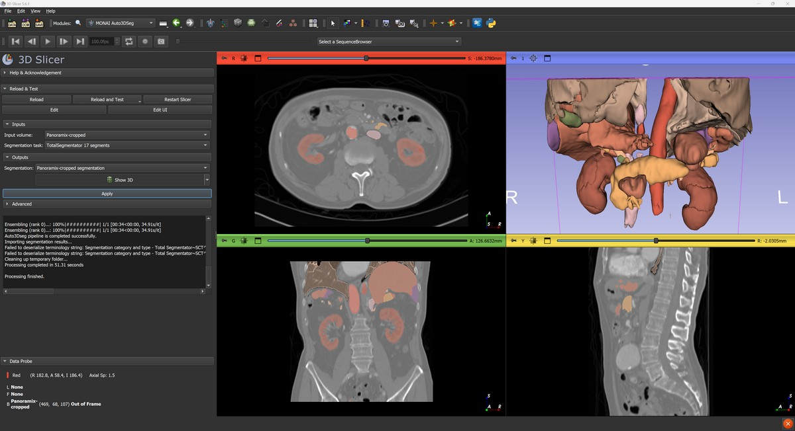
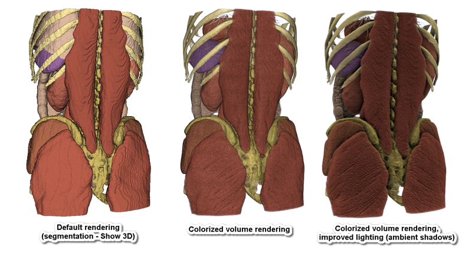

# MONAIAuto3DSeg

Extension for [3D Slicer](https://www.slicer.org) for fully automatic AI segmentation of images using [MONAI Auto3DSeg models](https://docs.monai.io/en/stable/auto3dseg.html).

Highlights:
- Dozens of ready-to-use segmentation models: see **[complete list - with screenshots, computation times, list of segments](https://github.com/lassoan/SlicerMONAIAuto3DSeg/releases/tag/ModelsTestResults)**
  - multiple imaging modalities: CT (various abdominal organs, bones, vessels, heart, lungs, ...), MR (brain, prostate, ...)
  - both healthy anatomy and lesions (tumor, edema, hemorrhage, etc.) are segmented and segments are described by standard terminology (DICOM/SNOMED CT)
  - multiple input volumes may be utilized: currently used for prostate and brain tumor segmentation
  - models are automatically downloaded when needed (and cached in the user's home folder within `.MONAIAuto3DSeg` subfolder)
  - sample data set is provided for each model: one click for downloading test data, one click to segment it.
  - completely free (even for commercial use), restriction free license for all the software.
- Efficient processing:
  - processing time:
    - using CUDA-capable GPU: all models complete under 45 seconds
    - on workstation without GPU: under 1 minute (quick models), under 10 minutes (full-quality models)
    - on laptop without GPU: in 2-3 minutes (quick models), under 30 minutes (full-quality models)
  - low hardware requirements: most models do not require GPU (runs on any laptop), GPU does not need to have more than 8GB RAM
  - most processing runs in the background, therefore the application can be used normally while the segmentation is in progress
- Offline:
  - Network connection is only needed during installation and downloading of models.
  - All data remains on the user's computer, all computation is performed locally.

_Note: The developers do not claim that the tools are appropriate for any specific clinical purpose and the user is responsible for obtaining any necessary ethics or regulatory approvals._

## Setup

1. Setup your GPU driver (optional)

If you have a powerful GPU is available then a full-quality segmentation can be computed within a minutes, instead of 10 minutes or more on the CPU.

- If a strong GPU with 7GB or more memory is available:
  - On Windows:
    - If using NVIDIA GPU: Make sure CUDA is installed. [CUDA version must be one of those listed on pytorch website as "Compute platform" for your system](https://pytorch.org/get-started/locally/). You can download CUDA from [here](https://developer.nvidia.com/cuda-downloads).
    - If using AMD GPU: PyTorch does not officially support AMD GPUs on Windows, therefore if you have such a GPU then you may be limited to using the CPU.
  - On Linux:
    - If using NVIDIA GPU: Make sure NVIDIA drivers are installed. If CUDA is installed then make sure [CUDA version is one of those listed on pytorch website as "Compute platform" for your system](https://pytorch.org/get-started/locally/). If CUDA is not installed then it will be set up automatically during installation (pytorch binary packages contain the appropriate CUDA version).
    - If using AMD GPU: In theory, ROCm-compatible AMD GPUs should work, but this is not tested.
  - On macOS: PyTorch might be able to use some harware acceleration, but this is not tested.
- If a weak GPU is available: if segmentation fails, then enable `Force to use CPU` checkbox in `Advanced` section and retry the segmentation.
- If no GPU is not available: Graphics driver updates or CUDA installation is not necessary, everything will still work, it will just take more time. Minimum 16GB CPU RAM is strongly recommended: if your computer has 16GB RAM then it is recommended to exit other programs (especially web browser) when using full-quality models. If the computer has less than 16GB RAM or the memory is used up by other running programs then virtual memory will be used and processing can be 10-100x slower.

2. Install latest version of [3D Slicer](https://slicer.readthedocs.io/en/latest/user_guide/getting_started.html#installing-3d-slicer)

3. [Install `MONAIAuto3DSeg` extension in 3D Slicer](https://slicer.readthedocs.io/en/latest/user_guide/extensions_manager.html#install-extensions)

## Tutorial

- Start 3D Slicer
- Go to `MONAI Auto3DSeg` module
- Select model: `Abdominal Organs TS2 - quick`. Tip: use `quick` models if you do not have a GPU to get lower-resolution segmentation in a few minutes (computing full-quality segmentation on CPU may take up to a few ten minutes).
- Select input volume: choose the image that will be segmented. If you do not have images to test with, then click the `Download sample data set...` icon button (next to the model selector) to download a sample data set suitable for the selected model.
- Click `Apply`
  - When this module is used the first time: The module will download and install a few Python packages (largest ones are PyTorch and MONAI) and weights for the AI models. This can take 5-10 minutes and several GB disk space. To ensure successful installation, have 20GB free disk space before starting this step.
  - Expected computation time: with CUDA-capable GPU computation time is under a minute, without discrete GPU computation time may be up to about 10x longer. See typical computation times for each model on [this page](https://github.com/lassoan/SlicerMONAIAuto3DSeg/releases/tag/ModelsTestResults).
- To display the segmentation in 3D: click the `Show 3D` button.
- For high-quality rendering in 3D:
  - Switch to `Colorize volume` module (provided by `Sandbox` extension).
  - Click `Apply` to display the segmented image with default settings. Voxel intensities will be set based on the original image, while their color and opacity is determined by the segmentation.
  - Switch to `Lights` module (also provided by `Sandbox` extension) to further optimize appearance in 3D.
  - Click `Select all` button in `Managed 3D views` row (top-right corner).
  - Check `Enable` in `Ambient shadows` section and move the `Size scale` slider until the desired shadow appearance is achieved.

## User interface

- Segmentation model: select the model that determines what is segmented from the input image(s). Hover the mouse over the model name to get more information about the model.
- Search model: multiple words can be typed here; only those models will be listed that contain all those words in their name, description, or imaging modality. For example, enter `quick ct` to get all quick models for CT images.
- Download sample data: small icon next to the model selector, clicking it downloads a sample data set that can be used for testing the model
- Inputs
  - Input volume: input image; for certain models multiple input volumes must be selected
  - Segmentation task: currently, all models are experimental (not very accurate)
- Outputs
  - Segmentation: the selected segmentation will store the computation result
  - Show 3D: show/hide segments in 3D views
- Advanced:
  - Use standard segment names: use names defined in standard terminology files from [DCMQI](https://github.com/QIICR/dcmqi) (enabled by default). If disabled then internal names will be used as segment names.
  - Force to use CPU: useful if the computer has a GPU but not powerful enough to run the model
  - Show all models: if unchecked (default) then only the latest version of the models are displayed
  - Manage models: allow cleaning up downloaded models (each model may take up a few hundred MB disk space)
  - Force reinstall: force reinstallation of the AI engine - MONAI Python package. This may be needed if other modules compromise the installation.
  - Get Python package information: retrieve installed version of the AI engine.

## Troubleshooting

### Segmentation fails

Problem: Segmentation fails while predicting and the `RuntimeError: CUDA out of memory.` message is found in the message log (textbox under the Apply button).

Explanation: This means that a CUDA-capable GPU is available, but it is not powerful enough for the chosen task.

Solution: It is recommended to switch to use the CPU by the following steps:
- Go to `PyTorch Util` module, click `Uninstall PyTorch`. An error may be reported at the end of this step, as some PyTorch files are in use. Click `Restart the application` button to unload all PyTorch files.
- Go to `PyTorch Util` module, select `cpu` as `Computation backend`, and click `Install PyTorch`.

If your GPU has more than 7GB memory and you still get this error then the error message might indicate that the PyTorch CUDA version does not match the CUDA version installed on the system. Reinstall PyTorch with the correct CUDA version by following the instructions given below for [GPU is not found](#gpu-is-not-found).

### GPU is not found

Problem: Your computer has a CUDA-capable GPU but MONAI reports that GPU is not available.

Explanation: CUDA may not be installed on the system or CUDA version in PyTorch does not match the system CUDA version.

Solution:
- Make sure that the the CUDA version installed on the system [is one of those listed on pytorch website as "Compute platform" for your system](https://pytorch.org/get-started/locally/). You can download CUDA from [here](https://developer.nvidia.com/cuda-downloads).
- Go to `PyTorch Util` module, click `Uninstall PyTorch`.
- An error may be reported at the end of this step, as some PyTorch files are in use. Click `Restart the application` button to unload all PyTorch files.
- Go to `PyTorch Util` module, select the `Computation backend` that matches the system CUDA version, and click `Install PyTorch`. The CUDA computational backend name has the format `cuNNN`, where _NNN_ corresponds to the CUDA major+minor version. For example, CUDA 11.7 backend name is `cu117`.

### Segmentation is inaccurate

If significant segmentation inaccuracy is observed then you can [submit an issue](https://github.com/lassoan/SlicerMONAIAuto3DSeg/issues) to discuss it.

### Fail to download model files

Model files are hosted on github.com and downloaded automatically when segmenting the first time. Institutional firewall or proxy servers may prevent interfere with this. Potential solutions:
- talk to IT administrators or use a VPN to access the server
- download the model file manually from https://github.com/lassoan/SlicerMONAIAuto3DSeg/releases/download/Models/ and unzip it in the `.MONAIAuto3DSeg/models` folder in the user's profile (for example in `c:\Users\(yourusername)\.MONAIAuto3DSeg\models\whole-body-3mm-v2.0.0`)

## Developers

### Training models

#### General guidelines

These guidelines are recommended for creating models to provide good experience for a wide range of users:
- Required GPU memory of all the provided models must not be more than 7GB (then we can run the models comfortably on a 8GB GPU that is fairly commonly available). It is just not worth the time to make models widely available that everyday users cannot run on their computers. Models can be split to smaller models or resolution can be reduced. If the model uses more memory than this then the model is not ready yet, we should not release it.
- There must be a low-resolution version of every model that can be executed on CPU under 3 minutes, without using more than 4GB RAM (so that it can run on a computer with 8GB RAM).
- Full-resolution model should not require more than 5 minutes to run on GPU (this is about the maximum time that is acceptable for intraoperative use; this is also an expectation that is set by TotalSegmentator's few-minute computation time).
- The model should leave at least 1 CPU core unused to make sure the computer remains usable.
- Make the model work on easily accessible test data sets. The model should work well on relevant Slicer sample data sets. If none of the current sample data sets are relevant then provide at least one new data set for testing (the extension can register custom data sets into the Sample Data module).

#### How to train a new model from scratch

This 3D Slicer extension is only for running inference. You can train the Auto3D using by following [Auto3DSeg examples](https://github.com/Project-MONAI/tutorials/tree/main/auto3dseg/tasks) or [tutorial](https://github.com/Project-MONAI/tutorials/blob/main/auto3dseg/README.md).

Additional suggestions:
- Create the YAML and JSON file to train Auto3DSeg on your dataset. JSON file will need at least two folds (fold means a group of training samples, useful for cross validation). You can repeat the folds using the whole training set on each fold.
- Only use the SegResNet architecture when training your model. It works great and makes the training faster. Here is an example of the script: `python -m monai.apps.auto3dseg AutoRunner run --input ./my_task.yaml --algos segresnet --work_dir ./outputs/output_my_task`
- Once it is trained, you will find a model.pt file inside the `./outputs/output_my_task/segresnet_0/model` folder. That's the one you could use in this extension. Add a labels.csv in the same folder as the model.pt file to describe the meaning of each label value.
- The label indices representing the segments must match the number of segments and be consistent throughout the dataset. For example, if you want to segment 4 regions - liver, tumor, pulmonary vein, and hepatic veins - the indices must be 1, 2, 3, 4 and the liver is always index 1, pulmonary vein is always 3, etc.

### Model files

Model files must be stored in a zip file.

Filename is composed as: <modelname>-v<version>.zip
- `modelName`: identifier of the model, preferably all lowercase, words separated by dashes. This string is used for storing the user's model selection in the Slicer scene (along with the version).
- `version`: it must be in the format `<major>.<minor>.<patch>`, where each component is an integer.
  - `major`: increment it if segments are added/removed or a major change is made in the model
  - `minor`: increment it if model quality, speed, etc. is improved
  - `patch`: increment if there are any other changes in the model files

File content:
- labels.csv: Contains maping from label value to internal name and standard terminology. The file may be in a subfolder within the zip achive, but it is recommended to be placed directly in the root folder in the zip archive (if the file is not found in the root folder then the whole archive content will be searched).
- model.pt: Model weights. It must be in the same folder as labels.csv.

## Contributing

Contributions to this extensions are welcome. Please send a pull request with any suggested changes. [3D Slicer contribution guidelines](https://github.com/Slicer/Slicer/blob/main/CONTRIBUTING.md) apply.

## Contact

Please post any questions to the [Slicer Forum](https://discourse.slicer.org).
