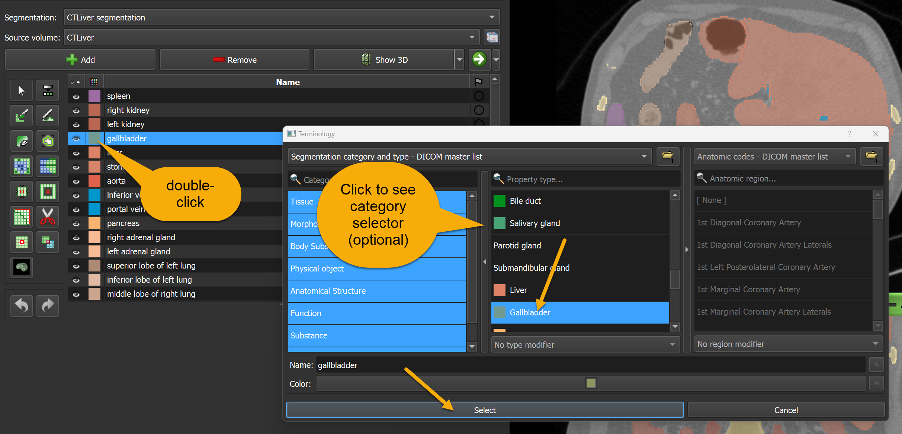
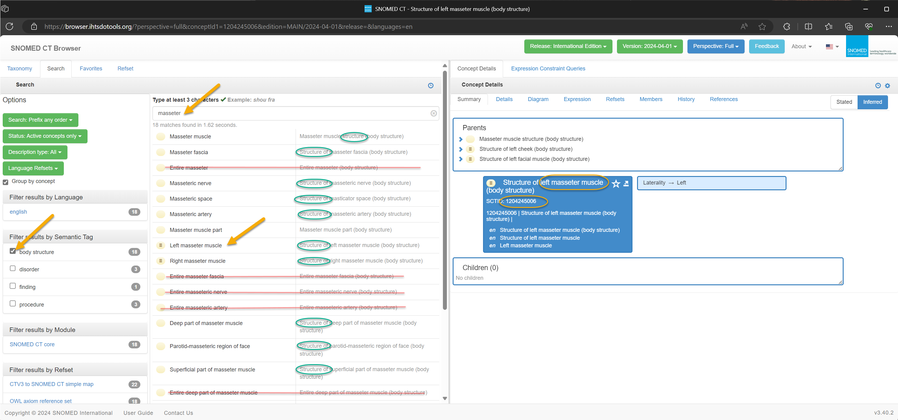
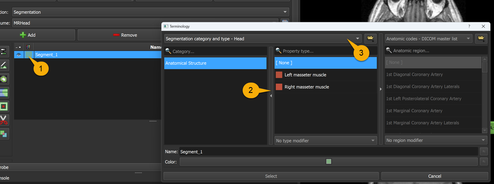

# How to get standard codes for describing segment content

A segmentation model provides a labelmap volume as output, with each label (voxel) value corresponding to a segment. To define the meaning of each lable, it is common practice to provide a mapping from label value to a "segment name". Segment name is often just a simple common English name for an anatomic strucute. Unfortunately, using such names are very error-prone, as there could be many different variants for the same word (e.g., `Left Lung`, `Lung, Left`, `left lung`, or `esophagus`, `Oesophagus`, `oesophagus` ...) and the meaning of the name may not be exactly defined.

To avoid these issues, it is important to use well-defined, standard terminology when you specify what each segment represents - an anatomical structure, physical object, body substance, etc.

A standard term has well-defined meaning, allows aggregating data from many sources, and using terminology selectors instead of relying on users typing free text helps with avoiding errors.

## Specifying term for a segment during segmentation

3D Slicer comes with a [number of terminologies](https://github.com/Slicer/Slicer/blob/main/Modules/Loadable/Terminologies/Resources) that contain the most commonly used terms. You can select them by clicking the colored box in the segment list.



## How to add custom terms

If you work with less commonly used structures then there is a chance that the the term you need is not included in the list of terms that are bundled with Slicer.

In this case, you can have a look if you can find the term in [DICOM controlled terminology definitions](https://dicom.nema.org/medical/dicom/current/output/chtml/part16/chapter_d.html).

If it is not available there either then you can find the SNOMED CT terminology code by following these steps:
- Go to [SNOMED CT browser](https://browser.ihtsdotools.org/), accept the license agreement
- Click "Go browsing international edition"
- Check the "body structure" checkbox on the left side in "Filter results by Semantic Tag" section
- In the search box, type the structure you segment - for example: `masseter`
- Click on the relevant item in the list below, for example `Left masseter muscle`. *Tip:* ignore the items that start with `Entire` word (it has a special meaning that it is not used in DICOM), instead select the item that has description starting with `Structure of` or ends with `structure`.
- The information that you need are the structure name and SCTID values that are displayed on the right side in "Concept details" section, For example, `left masseter muscle` and `1204245006`.



To make these terms selectable in Slicer:

1. Create a new text file and save it with `.term.json` file extension, for example `SegmentationCategoryTypeModifier-Head.term.json` that contains the list of the terms you want to use. For example:

```json
{
  "SegmentationCategoryTypeContextName": "Segmentation category and type - Head",
  "@schema": "https://raw.githubusercontent.com/qiicr/dcmqi/master/doc/segment-context-schema.json#",
  "SegmentationCodes": {
    "Category": [
      {
        "CodingSchemeDesignator": "SCT", "CodeValue": "123037004", "CodeMeaning": "Anatomical Structure",
        "showAnatomy": false,
        "Type": [
          { "CodingSchemeDesignator": "SCT", "CodeValue": "1204245006", "CodeMeaning": "Left masseter muscle", "recommendedDisplayRGBValue": [180, 80, 60] },
          { "CodingSchemeDesignator": "SCT", "CodeValue": "1204246007", "CodeMeaning": "Right masseter muscle", "recommendedDisplayRGBValue": [190, 80, 60] }
        ]
      }
    ]
  }
}
```

2. Drag-and-drop this file into the Slicer application window. This adds the file to the list of custom terminologies. If everything goes well then no message will be displayed.

3. Double-click the colored rectangle to open the terminology selector, click the left-arrow button to show the terminology context selector, and select your terminology. For example, `Segmentation category and type - Head`



## Use standard terminology during model training

For model training, you will need to consitently use the same label value for the same segment. The segmentation (.seg.nrrd) files may have the segments in different order, therefore different label values may be used for the same segment in each file.

You can use the [slicerio Python package](https://pypi.org/project/slicerio/) to get a nrrd file with a consistent `segment name` -> `label value` mapping (see [example](https://github.com/lassoan/slicerio?tab=readme-ov-file#extract-selected-segments-with-chosen-label-values)). This normalization should be done only when preparing data for a specific model training. These normalized .nrrd files should not be archived (the source .seg.nrrd files should be archived and shared with other projects).

## Use standard terminology for model distribution

When your trained a model is ready for distribution with MONAI Auto3DSeg, you need to create a `labels.csv` file that specifies the term for each label value. You will use the same standard codes in this file as you used in the terminology json file above.

The format of this file is standard .csv, with self-describing column names:

```txt
LabelValue,Name,SegmentedPropertyCategoryCodeSequence.CodingSchemeDesignator,SegmentedPropertyCategoryCodeSequence.CodeValue,SegmentedPropertyCategoryCodeSequence.CodeMeaning,SegmentedPropertyTypeCodeSequence.CodingSchemeDesignator,SegmentedPropertyTypeCodeSequence.CodeValue,SegmentedPropertyTypeCodeSequence.CodeMeaning,SegmentedPropertyTypeModifierCodeSequence.CodingSchemeDesignator,SegmentedPropertyTypeModifierCodeSequence.CodeValue,SegmentedPropertyTypeModifierCodeSequence.CodeMeaning,AnatomicRegionSequence.CodingSchemeDesignator,AnatomicRegionSequence.CodeValue,AnatomicRegionSequence.CodeMeaning,AnatomicRegionModifierSequence.CodingSchemeDesignator,AnatomicRegionModifierSequence.CodeValue,AnatomicRegionModifierSequence.CodeMeaning
3,Neoplasm,SCT,49755003,Morphologically Altered Structure,SCT,86049000,"Neoplasm, Primary",,,,SCT,12738006,Brain,,,
2,Edema,SCT,49755003,Morphologically Altered Structure,SCT,79654002,Edema,,,,SCT,12738006,Brain,,,
1,Necrosis,SCT,49755003,Morphologically Altered Structure,SCT,6574001,Necrosis,,,,SCT,12738006,Brain,,,
```

`Name` column contains an internal (project-specific) name for the segment. It is only for convenience during development and testing.
